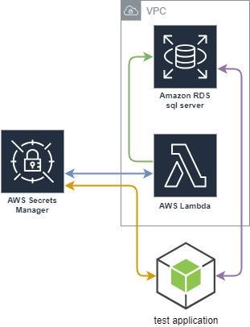

# AWS RDS with SQL Server with un/pw on demand

## Overview
POC project with LocalStack to determine best way to configure this with terraform and test



1. **<span style="color:blue">Blue Line</span>** -> AWS Secrets manager triggers rotation based on schedule, triggers lambda to rotate password, saves new password
2. **<span style="color:green">Green Line</span>** -> Lambda Function Connects to database with current primary master credentials, and rotates password for user account.
3. **<span style="color:orange">Orange Line</span>** -> Test Application Gets the credentials on startup from aws secrets manager
4. **<span style="color:purple">Purple line</span>** -> Test Application connects to Database using retrieved secrets

## Usage
## Start Containers
* navigate to `.devcontainer` folder
* run `dockr compose up --detach` from command line

### Create RDS Credentials 
#### Option 1: From Local Stack UI
* Open the LocalStack UI
* Navigate to Resource Browser -> Secrets Manager
* Add A Secret 
    * Name = `sqlserver_admin`
    * Secret String = `{"password":"Str0ngP@ssw0rd!","username":"admin"}` 
        * the password can be anything you want, however for this test, the one listed above will be fine

#### Option 2: From localstack Docker Container
* connect to docker container shell
* execute command
    ```bash
    awslocal secretsmanager create-secret --name sqlserver_admin --secret-string '{"username":"admin","password":"Str0ngP@ssw0rd!"}'
    ```

### Run Terraform to build the infrastructure
* connecto to terraform docker container shell
* navigate to the `/src` directory
```bash
cd /src
```
* run `terraform init`
* run `terraform apply -auto-approve`
    * on first run this may take a while, and potentially fail on the sql server build.  This is because localstack is downloading the database docker image in the background and the timeout may have expired.  If this happens just try again.

### Connect to test database with SSMS
* Get Current Password from Localstack UI
* navigate to Resource Manager -> Secret Manager -> `sqlserver_admin` -> Show Secret
    * you will get a json blob that has the credentials in it
* Open SSMS
* Connect to `localhost,4510`
* Use credentials from secret manager