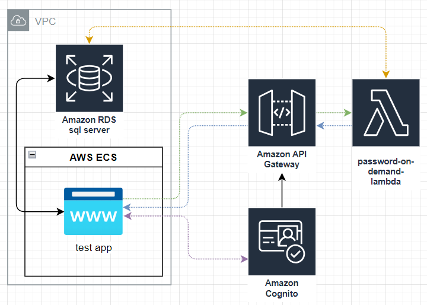

# AWS RDS with SQL Server with un/pw on demand

## Overview
POC project with LocalStack to determine best way to configure this with terraform and test



1. **<span style="color:purple">Purple Line</span>** -> app gets bearer token from aws cognito
2. **<span style="color:green">Green Line</span>** -> test app makes request to api for db credentials
    * this request will be authenticated using aws cognito, the bearer token should contain the proper access for the database needing access
3. **<span style="color:orange">Orange Line</span>** -> Lambda generates and upserts/credentials.
    * Username will be the test apps auth key (part of the request).
    * database connection information will be part of the cognito auth (i hope)
4. **<span style="color:blue">Blue line</span>** -> un/pw is securely sent back to test app
5. **Black Line** -> App logs into database and puts un/pw on the screen (for testing purposes)

## Api Call documents

### GET /api/credentials

#### Headers
```text
Authorization: Bearer <bearer token for api>
```

#### Response
##### 200 (successful)
```json
{
    "status" : "success",
    "password" : "<random password here>"
}
```

##### 404 (invalid auth)
```json
{
    "status" : "not found"
}
```


